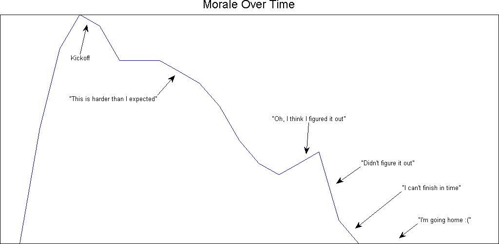
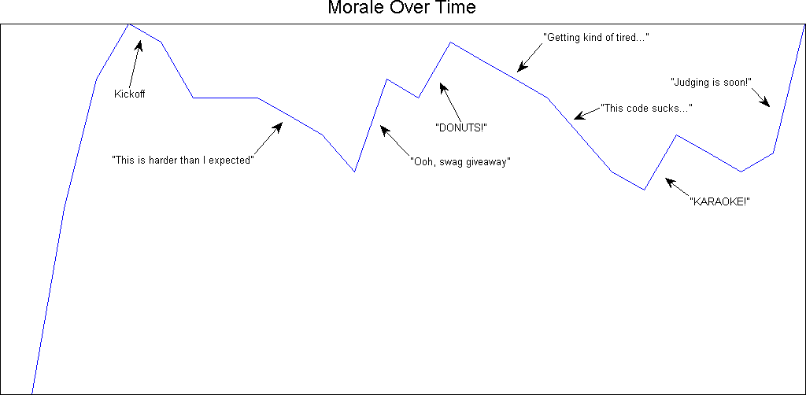
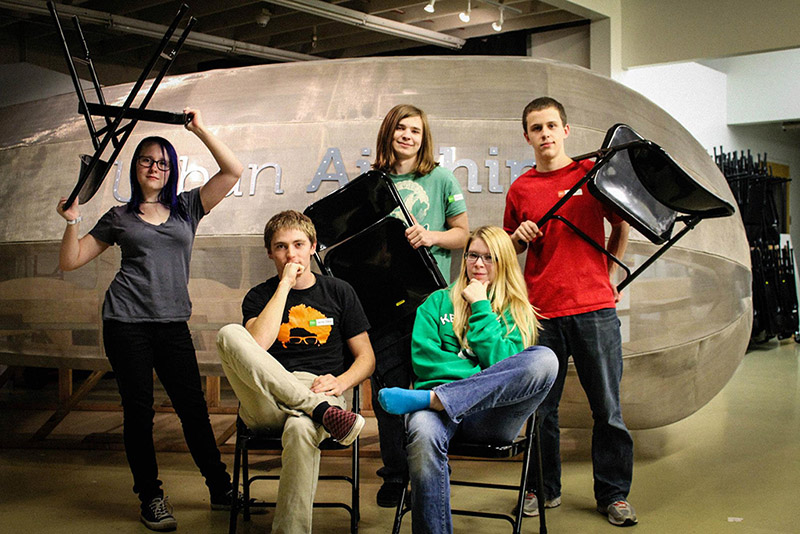
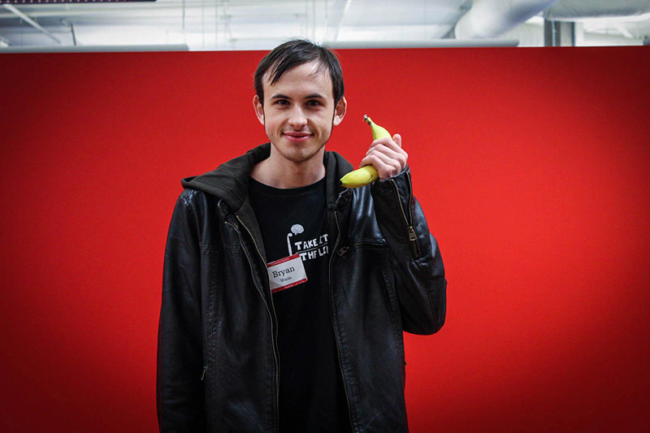

The Event
=========

Timeline
--------
Here's a brief timeline of what should be happening at the event:

    Time         Event
    -----------  ----------------------------------------------------
    11:30am      Doors open
    Noon         Kickoff
    Noon-thirty  Keynote
    1pm          Start taking photos
    1pm          Pitch ideas
    1:30pm       Pizza
    2pm          Workshops start
    2:30pm       Make sure everyone has a team
    5pm          Tell teams to sign up on the CodeDay site
    5pm-ish      Swag giveaway
    7pm          Dinner
    11pm         Team photos
    Midnight     Midnight snack
    2am          Karaoke
    4am          Go around handing out soda
    7am          Breakfast
    8am          Have teams sign up for presentations on CodeDay site
    9am          Judges go around and talk to teams
    10am         Presentations
    11am         Judges deliberate
    11am         Participants clean up
    11:30am      Awards
    Noon         Closing remarks
    Noon-thirty  Volunteers clean up

You might want to print this timeline and keep it somewhere central so you and your volunteers can make sure everything is on track.

We'll elaborate more on these events in the following sections.

Before the Event
----------------

You'll want to open the doors around 11:30am, since that's the time attendees usually start showing up. Make sure to have the check-in table staffed until at least 1pm.

If your venue has a front door which requires a key-code or badge to open, have a volunteer waiting at the door until you shut down the check-in table, too. (At which time you should put up a sign with several volunteers' phone numbers.)

Chat with people who look nervous or uncertain about the event, and try to answer their questions and reassure them that they're welcome at the event. This is important in preventing attrition in attendees who come without a group of friends or a pre-created team.

Kickoff & Keynote
-----------------

Start the event by giving an overview of CodeDay. This is extremely important, as many participants still don't quite know what CodeDay is, and this will set the tone for them. It's important not to make this boring, as many participants will be itching to start coding. You can use the [CodeDay Intro Video](http://www.youtube.com/watch?v=_ISs-R6guAE) to introduce CodeDay. 

###Sponsor Presentations

Thank the sponsors for making the event possible. Invite the Supporting & Presenting Sponsors to stage to speak for their allotted time. 

###Keynote

Invite the Keynote Presenter to the stage. Have them talk for 10 minutes or so, and encourage them to take questions if there's time. 

###Pitches

Pitches are important because many students don't have an idea for a project prior to CodeDay.

Encourage students to pitch ideas for games or apps they want to build. Students should be told that pitching an idea doesn't commit them to working on it, it doesn't have to be well-thought-out, and they can pitch as many ideas as they have.

Pitches usually start out slowly, so you may want to ask some volunteers to pitch ideas ahead of time. As soon as a few students pitch their ideas, more and more students will start participating.

As soon as you feel like you have enough, take a straw poll (yelling or hands) to find the intriguing ideas. Highlight the leaders of the top ideas, and then have everyone mingle and form teams over lunch.

This process may seem like chaos, but it tends to work out fairly well. About half of the attendees show up with a group of friends in mind, and the other half will either join the existing teams, or join the ideas. Our attempts to bring more structure to the process have failed.

Workshops
---------

In an hour, start the workshops. Begin with the beginner workshops. That way, the beginners have something to do while their teams start out on the ideas.

Throughout the event, announce the workshops shortly before they begin.

Energy
------

One of the biggest reasons teams at CodeDay fail to make it to presentations is that they run out of morale. In fact, this is true not just for CodeDay, but for the world as a whole. As Y Combinator's Paul Graham puts it in *How Not to Die*:

 > When startups die ... the underlying cause is usually that they've become demoralized.

The default state of a 24-hour programming experience goes something like this:

We've found that, at least for intervals as short as CodeDay, morale can usually be created with energy. By having mini events every few hours during the event, you can help keep attendees excited and happy:

Obviously, happy attendees means low attrition, high return registrants, and more recommendations. Make sure your volunteers are on the lookout for teams which seem demoralized, it's a critical part of the event which can easily go unnoticed.

## Activity Suggestions

Some of the activities we've found to be successful in the past:

 * 2am jog
 * soda-drinking contests
 * picture-drawing contests
 * free snack give-aways
 * mini programming contests
 * bubble tea runs
 * karaoke
 * swag giveaways
 * donuts
 * dancing
 * large group sing-alongs

Some of these activities don't work as official CodeDay activities, but you can organize smaller groups.

Photos
------

It's easy to forget about photos during the event, but if you want your events to grow in success, you should make every effort to take lots of them!

Photos are critical for brand recognition.

 > Participant: [tags self in photo from CodeDay]
 >
 > Participant's friend: You look like you're having lots of fun. I'm totally registering for the next CodeDay right now!

This conversation has literally never happened, however it seems to be a somewhat realistic model of a thought process, since registrations tend to increase for events held after an event with lots of good photos. CodeDay events are responsible for more changed profile photos on Facebook and Twitter per-participant than most holidays.

Beyond just driving sign-ups, photos can help you win-over potential sponsors.

Because of the importance of photos, it's useful to assign a specific volunteer to be in charge of photography for the event. (This task will occupy about 20-30% of a volunteer's available time.)

### Interval

How often should you take a photo? We believe the best interval is every 1 to 2 hours.

Constant photos at a <150-person event is annoying and silly. CodeDay is an event focused on programming, and while it's fun to take artsy shots of people staring contemplatively at an IDE, the inevitable repetition will be pretty obvious when they're uploaded to the gallery later.

Taking photos only once or twice, however, will lead you to totally miss out on interesting moments. CodeDay is often home to intense white-board sessions, people leading workshops in labcoats, interesting art sketches, Cocker Spaniel drawing contents, and people constructing tents.

What sort of interesting things happen at your CodeDay? Break-dancing? Nerf battles? Raves? Visits from Bill Murray? No one will ever believe you if you don't get them on film.

### What makes a photo good?

This question is far to vague to actually answer. As such, we should start with something we can answer: *what do we hope to gain by taking photos?*

As we discuss above, photos are most useful for brand recognition and driving future registrations. Think about what you want this event to feel like - what words come to mind? Fun, friendly, and intense are just a small few we often hear.

Chances are that potential participants want the same sorts of things from the event as you. So try to capture those feelings in your photos. The goal is to authentically capture the atmosphere of the event, so that people looking at the pictures will get a good feel for whether they're a cultural fit or not.

### Team Photos

Team Photos should be taken at 11pm. With two volunteers, the process will take an hour for a large CodeDay. (With only one volunteer it can take up to three hours, however.)

One volunteer should go around the venue harassing teams in a logical order. (Not all teams will be registered on the participant site at this point, so you should avoid using it as a list if at all possible.)

Upon arriving at the photo location, the photographer should write the team name on a sheet of paper to aid in correlating the photos in the CodeDay site (more on that in a moment), then take 5-10 photographs of the team from varying angles and distances. The goal is to avoid having to repeat a team later due to poor photo quality.

#### Location, location, location!

All the teams should be photographed at roughly the same location to give a sense of consistency.

If available, an event-specific backdrop works best for the photos. Otherwise, try to take the photos against a solid-colored wall, or other interesting backdrop. Use your artistic skill.

#### Post-processing

Traditionally, CodeDay photos have been processed in Adobe Photoshop Lightroom. The exposure and color temperature are normalized between all the photos, photos are cropped if necessary (taking care to preserve aspect ratio), then the "Punch", "Film Grain (Light)", and "Vignette 2" filters are applied.

Obviously, not all CodeDays will have the resources to do this, but you should strive to make the photos consistent and uniquely styled.

#### Uploading

Photos should be exported at 1080p, and uploaded to both the CodeDay site and Facebook.

On the CodeDay site, this can be accomplished as follows:

 1. Log into the CodeDay site with a volunteer account
 2. Go to the teams page
 3. Find the corresponding team
 4. Scroll to the Team Photo section
 5. Click the placeholder image, or the existing team photo if one exists
 6. Select "My Computer" and then browse for the file
 7. Click "Upload"
 8. Wait for the image to appear, then click "Update"

On Facebook, change the description text to the team name. Move the team photos to the bottom of the event photos when they're all uploaded.

The CodeDay Participant Site
----------------------------

While your CodeDay site will have gone into participant mode two hours before the start of the event, almost no participants will be aware of it. **This is a good thing;** CodeDay is about making things, not about putting together team profiles, so the site should be used as little as possible.

The participant-mode CodeDay site is quite useful for you as an organizer, however. The site was created to reduce the amount of time spent coordinating team information for presentation lineups and to create a wrap-up site after the event.

### Logging in as an Attendee
Attendees should log in using the first and last name from their ticket. Logins are case-insensitive. Attendees do not need a password when logging in for the first time. (The software will request that they set a password, however it's optional.)

### Common issues with the site

A lot of login issues don't actually matter; as long as one person on the team can log in, the team information can still be populated. Here are some solutions to common problems, regardless:

#### If a participant forgets their password
You can reset passwords for participants by selecting them from the People page while logged in as a volunteer, then choosing "Change Password".

#### If a participant registered at the door

You will need to add them with EventBrite, then run a sync in the Admin console.

#### If a participant doesn't have a ticket

Sometimes, people register tickets for friends under their name. If this happens, you'll need to log into EventBrite and change the name on one of the tickets.

### Getting Teams to Register

At 5pm and 10pm, and 9am, you should make an announcement to remind teams of the requirement to create a team profile online in order to present.

Some teams, obviously, will ignore your messages. This is not inherently a bad thing, since CodeDay is about programming and not profile pages. Teams which don't register on the system have tended to be the ones struggling the most, however, so you might want to talk to these teams and try to match them with mentors.

Judging
-------

With most events, judging starts directly after the end of the presentations, which can lead to participants being judged more on presentation skills than on actual product. For many events, this makes sense. CodeDay, however, is about programming skills, so we try to remove judging from presentation skills by having judges arrive early and try out the products.

Judges should arrive an hour before the presentations start and be lead around by a volunteer. Have judges start in different areas; at least one judge should see each project regardless of the size of the event.

### Judging Criteria

CodeDay projects are judged on the following priorities

 1. Would you use it? (Or could you imagine a lot of people doing so?)
 1. Creativity
 1. Polish

Projects should *not* be judged on business models (although having one could be considered a bonus to Polish).

### Deliberation

After presentations, judges deliberate on awards. How this happens is obviously up to the judges, however we've found that deliberation often works easiest when it follows this format:

 1. Remove teams everyone agrees is out. Write the rest on a whiteboard/notepad.
 1. Have people choose their top picks for the main awards; circle these.
 1. Discuss the circled teams, and pick the ranking.
 1. Have judges nominate teams for special awards, if available.
 1. Discuss and assign special awards.

Often, judges will want to change the special awards. Judges should never throw out awards for which a team has obviously competed, however making other changes to the awards lineup is okay if the organizers are okay with it.

### Presenting Awards

Awards should be presented in the format which generates the most happiness. This tends to be:

 1. Second place
 1. First place
 1. Special awards
 1. Honorary mentions

This prevents teams from knowing they won't win an award early-on (except for the second place teams), and still gives them things to hope for.

Presentations
-------------

The end of the event is in sight! This is the time when your attendees will be the most excited or stressed, so make sure you do whatever you can to help.

### Getting ready for presentations

An hour before the judges arrive, you should turn on "Presentation Sign-up" in your organizer console, and make an announcement for teams to register for presentations. (This is necessary because of a usual attrition during the time between team photos and presentations.) You can then use the "Presentation Schedule" function of the organizer console to get a randomized presentation schedule.

Have teams check the schedule to make sure they're on it.

### Running the Presentations

CodeDays at capacity (~120 attendees) tend to produce around 20 presentations, so make sure you budget accordingly.

Have a volunteer announce the team name, and help them connect their laptop to the projector. Make sure you have the necessary cables or adapters to support HDMI, DVI, VGA, and both styles of Mac display port.

Attendees should be given at most 5 minutes for the presentation. To keep the event moving, you should cut them off after 5 minutes 30 seconds. Luckly, most presentations don't go over 3 minutes, so even a large CodeDay won't go much longer than an hour. Pulling up a timer on an iPad and having a volunteer near the front of the audience is useful in cutting down presentation times.

If you have few enough presentations (around 10 or less), you may want to leave time for questions from the judges or audience. For larger events, skip this - the judges should have had time to talk to the teams earlier, anyway.

If you're going to be running close on time, ask teams to line up to the side when it's close to their turn, and then have the volunteer announcing teams call the next team "on deck". Teams should have their laptop open, game loaded, and ready to go. You can also have teams A/V check before the presentations start to save time.

### When Something Goes Wrong

Teams spend 24 hours working on a product, so it's crushing to be unable to present because of a graphics driver glitch.

If a team has a technical issue with their presentation and can't resolve it quickly, have them go off-stage and fix it, then have them redo the presentation at the end.
